<div align="center">


<a href="https://git.io/typing-svg"></a>

<br/>


<br/><br/>


</div>

<br/>

## 🧠 Who Am I?

```python
class NamlessDev:
    def __init__(self):
        self.name       = "NamlessDev"
        self.role       = "Bot & Full-Stack Developer"
        self.languages  = ["C", "C++", "Python", "Java", "TypeScript", "JavaScript"]
        self.builds     = ["Telegram Bots", "Web Apps", "Automation Tools"]
        self.goal       = "Ship products people actually use"
        self.status     = "Always building, always learning"

    def say_hi(self):
        print("Let's build something amazing 🚀")

me = NamlessDev()
me.say_hi()
```

<br/>

## ⚡ Tech Stack

<div align="center">


</div>

<br/>

## 📈 Language Mastery

<div align="center">


</div>

<div align="center">


</div>

<br/>

## 💓 I'm Alive

<div align="center">



</div>

<br/>

## 🎯 Goals

<div align="center">


</div>

<br/>

## 📦 Contributions

<div align="center">


<br/>


<br/>


</div>

<br/>

## 📊 GitHub Stats

<div align="center">


<br/>


<br/>


<br/>


</div>

<br/>

## 🐍 Contribution Snake

<div align="center">


<sub>⚙️ Auto-updates daily via GitHub Actions</sub>

</div>

<br/>

## 🏆 Trophies

<div align="center">


</div>

<br/>

<div align="center">


<blockquote>
<i>"Code is like humor. When you have to explain it, it's bad."</i><br/>
— Cory House
</blockquote>

</div>

<br/>

## 📫 Connect With Me

<div align="center">

<a href="https://t.me/NamlessDev"></a>
<a href="https://github.com/NamlessDev"></a>

</div>

<br/>


<!--
🐍 SNAKE SETUP (one-time, ~2 min):
1. In this repo → Settings → Actions → General → Workflow permissions → set to "Read and write permissions" → Save
2. Create .github/workflows/snake.yml with:

name: snake
on:
  schedule:
    - cron: "0 */6 * * *"
  workflow_dispatch: {}
  push:
    branches: [ main ]

jobs:
  build:
    runs-on: ubuntu-latest
    steps:
      - uses: Platane/snk/svg-only@v3
        with:
          github_user_name: NamlessDev
          outputs: |
            dist/github-contribution-grid-snake.svg
            dist/github-contribution-grid-snake-dark.svg?palette=github-dark
      - uses: crazy-max/ghaction-github-pages@v4
        with:
          target_branch: output
          build_dir: dist
        env:
          GITHUB_TOKEN: ${{ secrets.GITHUB_TOKEN }}

3. Commit → creates an "output" branch with the snake SVG → the image above loads automatically.
-->
